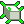

# NormalFix



NormalFixは、3ds Max・Maya・Blenderでポリゴンメッシュの法線と不自然なシェーディングを補正するツールです。

複数メッシュを選択して一括処理できます。

## ファイル構成

次のファイルを同じフォルダに置いてください。

```text
NormalFix/
├─ NormalFix_MAX.py
├─ NormalFix_Maya.py
├─ NormalFix_Blender5.py
├─ NormalFix_Manual.html
├─ NormalFix.png
└─ readme.md
```

| ファイル | 対応ソフト | 内部バージョン |
|---|---|---:|
| [`NormalFix_MAX.py`](./NormalFix_MAX.py) | 3ds Max 2021以降 | Ver1.3.4 |
| [`NormalFix_Maya.py`](./NormalFix_Maya.py) | Maya 2025／2026 | Ver1.0.2 |
| [`NormalFix_Blender5.py`](./NormalFix_Blender5.py) | Blender 5.0 | Ver1.0.2 |
| [`NormalFix_Manual.html`](./NormalFix_Manual.html) | 共通HTML説明書 | Ver1.0.1 |
| [`NormalFix.png`](./NormalFix.png) | アイコン | — |

## 共通の処理順

1. 指定角度で自動スムース
2. 既存の明示的／カスタム法線をリセット
3. 反転している面法線を統一
4. 面積・角度を使ったウェイト付き法線で補正
5. 最後にモディファイアまたは履歴を確定

通常は初期設定のまま実行できます。

面の一部が明確に裏返っている場合だけ、「面法線の向きを統一」または「面法線を外向きに再計算」を有効にしてください。

## プリセット

| プリセット | スムース角度 | 用途 |
|---|---:|---|
| 標準 | 35° | 一般的なプロップや背景モデル |
| ハードサーフェス | 5° | 小さな角度差もハード境界として残す機械部品 |
| 滑らか | 90° | 広い範囲を滑らかにつなぐ曲面や有機的形状 |

角度が小さいほどハードエッジが増え、角度が大きいほど滑らかにつながります。

## 3ds Maxでの使い方

1. ジオメトリを1個または複数選択します。
2. 3ds Maxの［スクリプト］→［スクリプトを実行］を選択します。
3. [`NormalFix_MAX.py`](./NormalFix_MAX.py) を開きます。
4. プリセットまたは個別設定を選択します。
5. 「選択オブジェクトを補正」を押します。

### 3ds Max版の注意

- 日本語を含むパスから実行すると、3ds Max側で `UnicodeDecodeError` が発生する場合があります。
- その場合は、ツール一式を英数字だけのパスへ移動して実行してください。
- 「最後にモディファイアを集約する」が有効な場合、既存のモディファイアを含むスタック全体がメッシュへ確定されます。
- 集約後に戻す場合はUndoを使用してください。

## Mayaでの使い方

1. ポリゴンメッシュを1個または複数選択します。
2. Script Editorを開きます。
3. Pythonタブへ切り替えます。
4. [`NormalFix_Maya.py`](./NormalFix_Maya.py) を開き、ファイル全体を実行します。
5. 表示されたNormalFixウィンドウで設定します。
6. 「選択メッシュを補正」を押します。

Maya版は標準の `vertexNormalMethod` を使用し、次のウェイト方式を設定します。

- 面積＋角度
- 面積
- 角度

### Maya版の注意

- 「最後にコンストラクションヒストリを削除する」は初期状態で有効です。
- 有効な場合、NormalFixが作成した履歴だけでなく、対象メッシュの既存ヒストリも削除されます。
- 履歴削除後に戻す場合はUndoを使用してください。

## Blenderでの使い方

1. Blenderの［Scripting］ワークスペースを開きます。
2. [`NormalFix_Blender5.py`](./NormalFix_Blender5.py) をText Editorで開きます。
3. スクリプトを実行します。
4. 3Dビューで `N` キーを押します。
5. 「NormalFix」タブを開きます。
6. Object Modeでメッシュを1個または複数選択します。
7. 「選択メッシュを補正」を押します。

Blender 5版は `set_sharp_from_angle()` とWeighted Normalモディファイアを使用します。

### Blender版の注意

- 「最後にすべてのモディファイアを適用する」は初期状態で有効です。
- 有効な場合、NormalFix以外の既存モディファイアもスタック順に適用されます。
- シェイプキー、リンクオブジェクト、適用できないモディファイアがある場合は処理に失敗することがあります。
- モディファイア適用後に戻す場合はUndoを使用してください。

## 設定の目安

### 平面が膨らんで見える、陰影が波打つ

Weighted Normalを有効にして実行します。通常は面積＋角度ウェイトを使用してください。

### 一部の面が黒い、裏からしか見えない

面法線が反転している可能性があります。面法線の統一／外向き再計算を有効にします。

### ハードエッジが消える

ハードサーフェスプリセット（5°）を使用します。Blenderでは「シャープエッジを維持」も有効にしてください。

### 補正しても変化しない

明示的／カスタム法線が残っている可能性があります。法線リセットを有効にして再実行します。

### 確定後に補正を削除できない

集約、履歴削除、モディファイア適用によって結果がメッシュへ確定されています。直後にUndoしてください。

調整しながら確認する場合は、最後の確定処理を無効にして実行します。

## 補足

- Weighted Normalは、ベベルやChamferがあるハードサーフェスで特に効果的です。
- 直角面がベベルなしで直接つながっている場合、法線補正だけでは期待どおりの結果にならないことがあります。
- 重複頂点、重複面、穴、非多様体形状は、法線補正より先にメッシュを修復してください。

---

NormalFix README Ver1.0.0  
3ds Max Ver1.3.4 / Maya Ver1.0.2 / Blender Ver1.0.2
